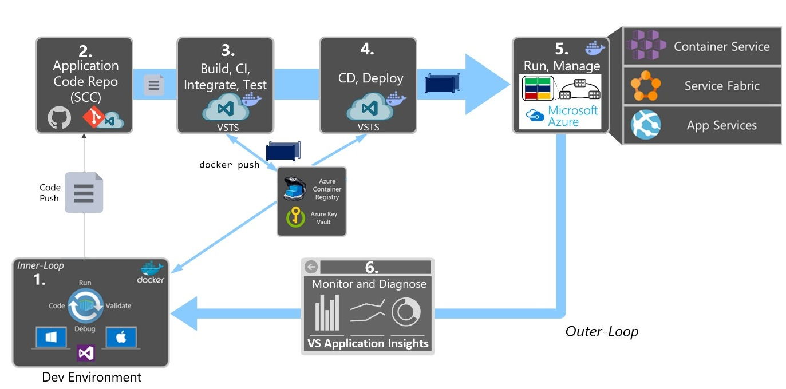

# Interstellar

The start of our intergalactic journey...
 
## Vision

The three pillars vision consists of:

- Developers (develop, design, test)
- DevOps (build, test, ship)
- IT Operations (run, monitor, manage)

The lifecycle of containerized applications is like a journey which starts with the developers, which are the first pillar in containerized application lifecycle vision. They are writing their code locally and their operating environment is defind with a dockerfile that specifies the base OS they run on, and the build steps for building their code into a Docker image. How the one or more images will inter-operate is defined using a deployment manifest. In this way we are moving as far left as possible, trying to avoid *"it works on my localhost"*. This approach eliminates frictions in deployments and with IT Operations, which ultimately helps to be more agile, more productive, end-to-end, and faster.

As local development is completed, developers push their application code to the code repository, where DevOps pillar defines the build-CI-pipelines using the dockerfile provided in the code repo. The CI system pulls the base container images from the Docker registries they’ve configured and builds t0he Docker images. The images are then validated and pushed to the Docker registry used for the deployments to multiple environments.

IT Operations, as a third pillar on the right, are managing deployed applications and infrastructure in production while monitoring the environment and applications, so they can provide feedback and insights to the development team about how the application could be improved.

## Containerized Application Lifecycle 

1. It all starts from the developer who starts writing code in the inner-loop workflow. Inner-loop defines
everything that happens before pushing code into the source control, triggering Continuous Integration (CI) pipeline executions.

2. At this step, we need a Version Control system to gather a consolidated version of all the code coming from the different developers in the team, which is already satisfied by imlementing git flow.

3. Once we have a Version Control system with the right code submitted, build service pick up the code and run the global builds and tests. The final artifacts are Docker images with application/services embedded within it. Those images will be pushed to Azure Container Registry.

4. The immutability of Docker images ensures a repeatable deployment with what’s developed and tested through CI. Once when the application Docker images are published in Docker Registry, we can deploy them to the various environments (production, QA, staging, ...) from VSTS Release Management.

5. Run and manage

6. Monitor and diagnose